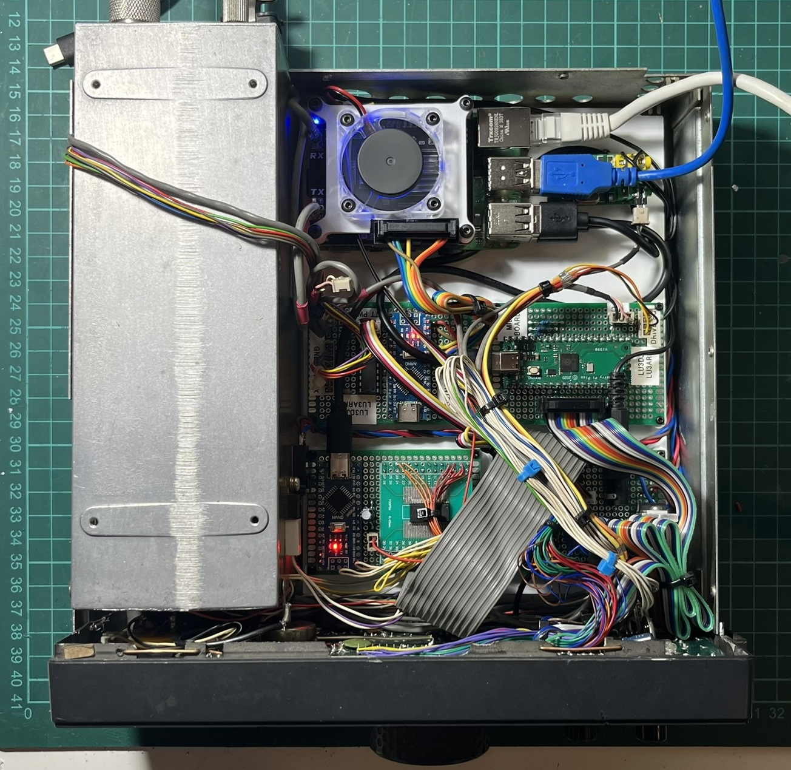

# Main Board Support para Yaesu FT-80C

Soporte impreso en 3D (PLA) para montar la Raspberry Pi y las 4 placas del proyecto dentro del Yaesu FT-80C, reemplazando la main board original.

## Placas soportadas

- [filter-control-arduino-ft-80c](../filter-control-arduino-ft-80c/) - Control del LPF board
- [lcd-controller-ft-80c](../lcd-controller-ft-80c/) - Control del LCD frontal
- [midi-controller-rp2040-ft-80c](../midi-controller-rp2040-ft-80c/) - Control MIDI
- [soft-shutdown-ft-80c](../soft-shutdown-ft-80c/) - Soft shutdown + fuente
